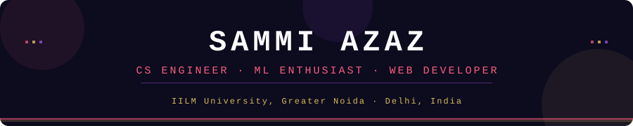

  

  
  
  
  

---

## 🧠 About Me

- 🎓 B.Tech in Computer Science & Engineering @ **IILM University, Greater Noida** (2023–2027)
- 💻 Aspiring **Software Engineer | Frontend Developer** passionate about building clean, responsive web apps
- 🚀 Built **TripNest** — an AI-powered full-stack travel planning platform (React.js + Node.js + Vercel)
- ☁️ AWS-certified and currently leveling up in **TypeScript** and **Full-Stack Development**
- 📱 Certified in **Social Media Marketing** — exploring digital content strategy
- 🤝 Strong believer in collaboration, problem-solving, and learning-focused development
- 📫 Reach me at: **sammiazaz2005@gmail.com**

---

## 🛠️ Tech Stack

### 💬 Programming Languages

  

### 🎨 Frontend

  

### ⚙️ Backend

  
  

### 🗄️ Databases

  

### 🧰 Developer Tools

  

### 📱 Social Media

  
  
  
  
  

---

## 🚀 Featured Projects

### ✈️ TripNest — AI-Powered Travel Planning Platform
> **React.js · Vite · Node.js · Express.js · REST APIs · Vercel** — *2025*

Full-stack travel platform where users can discover destinations, create and manage trips, organize itineraries, and collaborate with team members on shared travel plans. Built with a reusable, component-based React.js architecture and deployed on Vercel.

🔗 **Live:** [tripnest.vercel.app](https://tripnest.vercel.app) &nbsp;|&nbsp; 📂 **Repo:** [github.com/sammiazaz](https://github.com/sammiazaz)

---

### ❤️ Human Heart Disease Prediction System
> **Python · Scikit-learn · SMOTE · Pandas · NumPy** — *Dec 2025*

ML classification pipeline using Logistic Regression and Random Forest to predict heart disease risk from patient health indicators. Applied SMOTE to correct class imbalance and improve detection reliability for high-risk patients.

---

## 💼 Experience

| Role | Company | Duration |
|------|---------|----------|
| 🐍 Python Developer Intern | Shadowfox *(Remote)* | Jul 2025 – Aug 2025 |
| 🌐 Web Developer Intern | Prodigy Infotech *(Remote)* | Jun 2025 – Jul 2025 |

---

## 🏆 Certifications

- 📱 **Introduction to Social Media** — Jul 2026
- ☁️ **AWS Academy Graduate** — Machine Learning Foundations
- 🌐 **Web Development** Certification
- ☕ **Java Programming: Beginner to Master** — Udemy

---

## 🤝 Hackathons & Participation

- 🤖 Contributed to **Google Cloud Agentic AI Day** (Hack2Skill) — Feb 2025
- 🚀 Participated in **Bharatiya Antariksh Hackathon 2025**

---

## 📊 GitHub Stats

<table align="center" width="100%">
  <tr>
    <td width="45%" valign="top" align="center">
      
        
      
        
      
    </td>
    <td width="55%" valign="center" align="center">
      
    </td>
  </tr>
</table>

---

  

  <em>"First, solve the problem. Then, write the code." – John Johnson</em>

